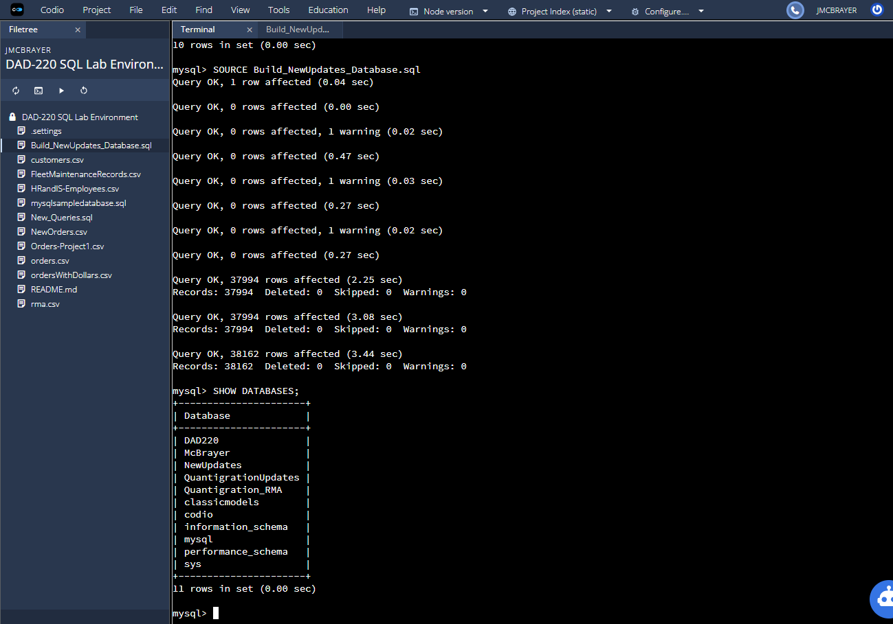
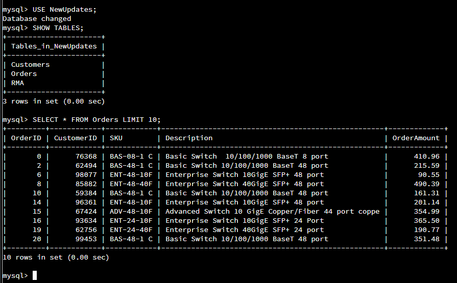
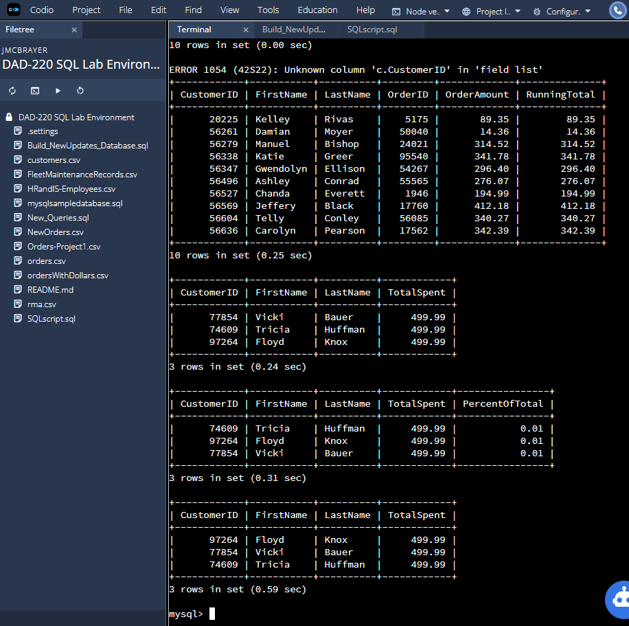

## Note on SQLScripts.sql
This file was developed to demonstrate all of the tasks that were performed in the original project, but in SQL script format.  It is not use for the enhancment, but strictly for demonstration purposes.

## SQL Script Usage
First you must have a running SQL database environment to utilize these scripts.
This is out of the scope of this project, but you can find more information on how to setup your own mySQL database [here](https://dev.mysql.com/doc/mysql-getting-started/en/).

Once you have a mySQL database (or any SQL database) then you can run the Build_NewUpdates_Database.sql script with the following command <code>SOURCE Build_NewUpdates_Database.sql</code>

You should see the script run and successfully run each query by returning Query OK.

Do confirm that the database built correctly and data was populated you can use the following commands:

To use the new database (NewUpdates in this case)  
<code>USE NewUpdate;</code>

Once in the database use the following to show all tables
<code>SHOW TABLES;</code>

Finally you can use a SELECT statement to validate the tables have data
<code>SELECT * FROM Orders LIMIT 10;</code>

To test out the new and advanced queries run the following:
<code>SOURCE New_Queries.sql</code>

This will run all of the queries one after another and show the output.  Each has a limit again used for demonstration purposes. Several have the same data output, but utilize different types of queries that can be useful depending on the situation.

